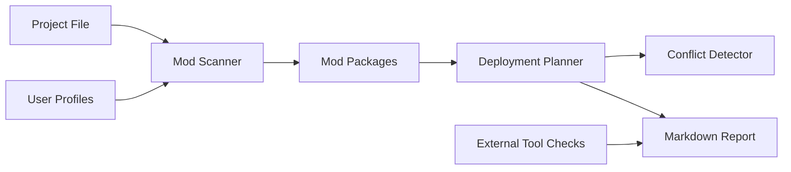

# Design

ModForge Manager is split into three layers:

1. Core domain logic in `src/modforge/core`.
2. Optional adapters in `src/modforge/containers`, `src/modforge/tools`, and
   `src/modforge/translation`.
3. Thin user interfaces in `src/modforge/cli.py`, `src/modforge/app.py`, and
   future richer widgets under `src/modforge/gui`.

The first scaffold keeps runtime dependencies at zero so tests can run in a
fresh Windows Python environment. Richer dependencies such as PySide6, Typer,
Pydantic, and archive-specific libraries can be added after the core behavior is
stable.

The current GUI is a lightweight `tkinter` shell. It should remain a thin caller
of core functions: project creation/loading, mod scanning, profile edits,
planning, staging/game apply, restore, and report saving.
The GUI table layer is still intentionally small, but it supports sortable mod
columns, detailed scan warnings, external-tool validation details, and progress
status around longer core calls.

User profiles are per-project mod sets. They store disabled mod ids and priority
order separately from the selected game profile, so one project can keep
multiple setups such as default, testing, translation, or boss-run loadouts.

`modforge doctor` is the lightweight release smoke check. It validates the
runtime, built-in profiles, and tkinter availability even before a project file
exists. After a project loads, it also checks project paths, configured tool
paths, and a non-mutating mod scan. It does not run external archive extractors
unless a future command explicitly opts into that behavior.

## Data Flow

## Priority Rule

Higher numeric mod priority wins a destination conflict. This is easy to display
and sort in both the CLI and future GUI.
