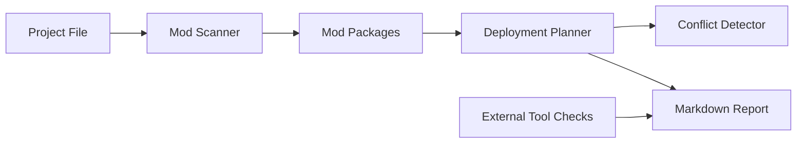

# Design

ModForge Manager is split into three layers:

1. Core domain logic in `src/modforge/core`.
2. Optional adapters in `src/modforge/containers`, `src/modforge/tools`, and
   `src/modforge/translation`.
3. Thin user interfaces in `src/modforge/cli.py` and `src/modforge/gui`.

The first scaffold keeps runtime dependencies at zero so tests can run in a
fresh Windows Python environment. Richer dependencies such as PySide6, Typer,
Pydantic, and archive-specific libraries can be added after the core behavior is
stable.

## Data Flow

## Priority Rule

Higher numeric mod priority wins a destination conflict. This is easy to display
and sort in both the CLI and future GUI.
